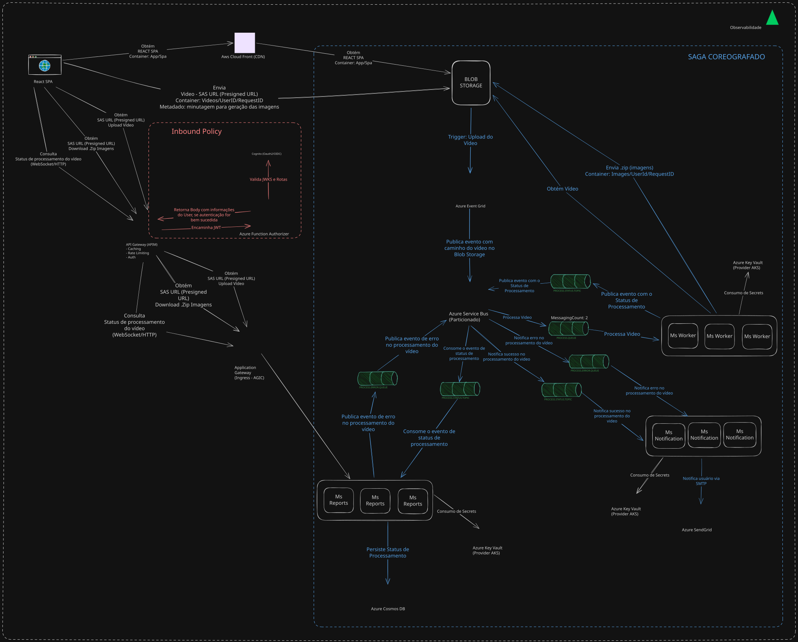
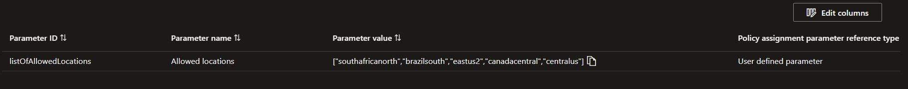

# 🏗️ VideoCore Infra

<div align="center">

Infraestrutura base do ecossistema VideoCore, provisionando AKS, Application Gateway, APIM, Key Vault, Cognito e demais serviços fundamentais. Desenvolvido como parte do curso de Arquitetura de Software da FIAP (Hackaton).

</div>

<div align="center">
  <a href="#visao-geral">Visão Geral</a> •
  <a href="#sytem-design">System Design</a> •
  <a href="#repositorios">Repositórios</a> •
  <a href="#tecnologias">Tecnologias</a> •
  <a href="#infra">Infraestrutura</a> •
  <a href="#estrutura">Estrutura</a> •
  <a href="#terraform">Terraform</a> •
  <a href="#arquitetura">Arquitetura</a> •
  <a href="#dbtecnicos">Débitos Técnicos</a> •
  <a href="#setup-tenant-principal">Setup do Tenant Principal</a> •
  <a href="#deploy">Fluxo de Deploy</a> •
  <a href="#instalacao">Instalação</a> •
  <a href="#contribuicao">Contribuição</a>
</div><br>

> 📽️ Vídeo de demonstração da arquitetura: [https://youtu.be/k3XbPRxmjCw](https://youtu.be/k3XbPRxmjCw)<br>

---

<h2 id="visao-geral">📋 Visão Geral</h2>

<details>
<summary>Expandir para mais detalhes</summary>

O **VideoCore Infra** é o repositório responsável por provisionar toda a infraestrutura base do sistema VideoCore na **Azure Cloud** e **AWS**, incluindo rede, orquestração, API Gateway, secrets, messaging e autenticação.

> ⚠️ Este repositório **não** provisiona recursos Kubernetes inerentes aos microsserviços (Deployments, Services, Ingress...), apenas o cluster AKS em si, os namespaces utilizados por eles, e `Helm Charts` de observabilidade `(Open Telemetry Collector)`.

> ⚠️ Este repositório **não** provisiona recursos de banco de dados, este é de inteira responsabilidade do repositório `videocore-db`.

### Principais Responsabilidades

- **Orquestração**: Azure Kubernetes Service (AKS) para microsserviços
- **API Gateway**: Azure API Management (APIM) com rate limiting, cache e subscription keys
- **Rede**: VNet com múltiplas subnets para isolamento de serviços
- **Segurança**: Azure Key Vault para gerenciamento de secrets
- **Autenticação**: AWS Cognito como Identity Provider (IdP)
- **Messaging**: Azure Service Bus para comunicação assíncrona
- **Storage**: Azure Blob Storage para armazenamento de vídeos e imagens
- **Observabilidade**: Open Telemetry Collectors para o New Relic

</details>

---

<h2 id="sytem-design">🧠 System Design</h2>

<details>
<summary>Expandir para mais detalhes</summary>



### Key Points

- Arquitetura de Microsserviços + Arquitetura Orientada a Eventos `(EDA)`;
- Comunicação assíncrona entre todos os microsserviços, maximizando a resiliência e evitando a necessidade de implementação de `Circuit Breakers`, gerenciamento de `Timeout` ou `Retries` por parte do cliente;
  - O processamento do vídeo é assegurado pelo `Azure Service Bus`.
- Utilização de `Pre-Signed URLs` para upload/download dos vídeos, removendo a responsabilidade de gerenciamento disto pelos microsserviços, além de reduzir gastos no `APIM`. Agora eles apenas geram as `URLs`;
- Utilização do `Blob Storage`, solução de armazenamento de objetos em nuvem, para persistência dos vídeos e das imagens, eliminando a necessidade de salvar isto em bancos de dados relacionais ou não relacionais;
  - Permite a configuração de políticas de `Tiering` automático para redução de custos.
- Fluxo de encaminhamento do vídeo para processamento até os microsserviços 100% gerenciado pela `Microsoft`, utilizando soluções `PaaS` `Serverless`, via `Azure Storage Account` + `Azure Event Grid` + `Azure Service Bus`. Removendo a responsabilidade de gerenciarmos de forma autônoma escalabilidade e HA;
  - Mesmo que nenhum microsserviço esteja saudável no momento, o evento permanece na fila.
- Utilização do `KEDA` para scaling horizontal dos pods do microsserviço `worker`, responsável pelo processamento efetivo do vídeo, via `Ffmpeg`, com base no número de eventos da fila `process.queue`;
  - Os demais Pods também possuem scaling horizontal, mas via `HPA` nativo;
  - O scaling horizontal dos PODs juntamente dos pontos mencionados anteriormente viabilizam o envio de múltiplos vídeos simultâneamente.
- Utilização do padrão `SAGA Coreografado` para implementação de transações que abragem mais de um microsserviço;
- Utilização de `CDN` para entrega rápida a aplicação SPA escrita em `NEXT`;
- Utilização de banco de dados `(Azure Cosmos DB)` desnormalizado  para rápida consulta `(CQRS)`;
- Disparo de notificações em tempo real e via e-mail;
  - Via e-mail utilizasse o  `SMTP` `(Azure Send Grid)`, removendo a responsabilidade de manutenir de forma autônoma um servidor de envio de e-mails, em termos de escalabilidade e HA;
  - Em tempo real utilizasse um endpoint `WebSocket`, através do protocolo `STOMP`, exposto por um dos microsservços.
- Utilização de Ingress via `Azure Application Gateway (LB Layer 7)` para acesso aos PODs dos microsserviços, configurado via `AKS AGIC`;
- Utilização de um Azure Key Vault para consumo de secrets, via `AKS Azure Key Vault Provider`;
- Segurança, Caching e Rate Limiting garantidos pelo `APIM`, que por sua vez também é `Serverless`;
  - Segurança se dá através de `Inbound Policies` que orquestram comunicação com uma `Azure Function Authorizer`, que por sua vez dialoga com o `Cognito`.
- Observabilidade (Tracing, métricas e logging) com `New Relic` e `Open Telemetry`;
- Comunicação privada entre serviços da arquitetura, expondo somente o necessário (vide limitações de assinatura).

</details>

---

<h2 id="repositorios">📁 Repositórios do Ecossistema</h2>

<details>
<summary>Expandir para mais detalhes</summary>

| Repositório | Responsabilidade | Tecnologias |
|-------------|------------------|-------------|
| **videocore-infra** | Infraestrutura base | Terraform, Azure, AWS |
| **videocore-db** | Banco de dados | Terraform, Azure Cosmos DB |
| **videocore-auth** | Microsserviço de autenticação | C#, .NET 9, ASP.NET |
| **videocore-reports** | Microsserviço de relatórios | Java 25, GraalVM, Spring Boot 4, Cosmos DB |
| **videocore-worker** | Microsserviço de processamento de vídeo | Java 25, GraalVM, Spring Boot 4, FFmpeg |
| **videocore-notification** | Microsserviço de notificações | Java 25, GraalVM, Spring Boot 4, SMTP |
| **videocore-frontend** | Interface web do usuário | Next.js 16, React 19, TypeScript |

</details>

---

<h2 id="tecnologias">🔧 Tecnologias</h2>

<details>
<summary>Expandir para mais detalhes</summary>

| Categoria | Tecnologia |
|-----------|------------|
| **IaC** | Terraform |
| **Cloud (Azure)** | AKS, APIM, App Gateway, Key Vault, Service Bus, Blob Storage, App Insights |
| **Cloud (AWS)** | Cognito |
| **Emulação** | LocalStack, Azurite, MailDev |
| **Container Registry** | Azure Container Registry (ACR) |
| **CDN** | CloudFront |
| **CLI** | Go (sbcli - Service Bus AMQP - Durante desenvolvimento local) |
| **CI/CD** | GitHub Actions |

</details>

---

<h2 id="infra">🌐 Infraestrutura</h2>

<details>
<summary>Expandir para mais detalhes</summary>

### Topologia de Rede (10.0.0.0/24)

| Subnet | CIDR | Função |
|--------|------|--------|
| **AKS Nodes** | 10.0.1.0/24 | Serviços do Kubernetes |
| **AKS Nodes** | 10.0.2.0/24 | Nós do Kubernetes |
| **APIM** | 10.0.3.0/24 | API Management |
| **Azure Functions PE** | 10.0.4.0/24 | Private Endpoints |
| **Service Bus** | 10.0.5.0/24 | Messaging |
| **Application Gateway** | 10.0.6.0/24 | Load Balancer (Layer 7) |

### Localização

- **Azure**: Recursos criados na região **Brazil South**, para menor latência
- **AWS**: Cognito em **Sa East**, para menor latência
  
### Performance

- Todos os recursos foram provisionados buscando alta disponibilidade, recuperação de desastres e auto-scaling horizontal (vide limitações de assinatura)
- **Azure Function**: Always On (reduz cold start)
- **APIM**: Caching
- **Amazon Cloud Front**: CDN para arquivos estáticos (Imagens, Frontend SPA...)

### Segurança

- Apenas os recursos necesários foram expostos para a internet, neste caso: **APIM** e **Frontend IP Configuration público** do **Aplication Gateway** (vide limitações de assinatura)
- **APIM**: Para segurança adicional, foi configurado rate limit
- **NSG**: Para controle granular de tráfego de rede a nível de recurso

### HA/DR

- Todos os recursos foram provisionados buscando redundância zonal e backup geográfico (vide limitações de assinatura)

</details>

---

<h2 id="estrutura">📦 Estrutura do Projeto</h2>

<details>
<summary>Expandir para mais detalhes</summary>

```text
videocore-infra/
├── terraform/
│   ├── main.tf               # Orquestração de 27+ módulos
│   ├── variables.tf           # 50+ variáveis de configuração
│   ├── outputs.tf             # Outputs para repositórios dependentes
│   ├── datasources.tf         # Data sources remotos
│   ├── backend.tf             # Estado remoto (Azure Storage)
│   └── modules/
│       ├── resource_group/
│       ├── vnet/
│       ├── aks/
│       ├── appgw/
│       ├── azure_key_vault/
│       ├── cognito/
│       ├── azure_function/
│       ├── apim/
│       ├── azure_service_bus/
│       ├── blob/
│       ├── cloud_front/
│       ├── event_grid/
│       ├── helm/
│       ├── acr/
│       ├── app-insights/
│       └── public_ip/
├── docker/
│   ├── docker-compose.yml     # 6 serviços para desenvolvimento
│   ├── config.json            # Configuração Service Bus (queues/topics)
│   └── env-example
├── scripts/
│   ├── init-user.sh           # Setup LocalStack + usuário teste
│   ├── az-integration.sh      # Integração Azure
│   ├── sbcli/                 # CLI Go para Service Bus (AMQP)
│   │   ├── main.go
│   │   └── amqp/
│   └── infra-*.sh             # Scripts de ciclo de vida
├── docs/                      # Assets de documentação
│         
└── .github/workflows/
    ├── ci.yaml                # Terraform fmt/validate/plan
    └── cd.yaml                # Terraform apply
```

</details>

---

<h2 id="terraform">🗄️ Módulos Terraform</h2>

<details>
<summary>Expandir para mais detalhes</summary>

O código `HCL` desenvolvido segue uma estrutura modular:

| Módulo | Descrição |
|--------|-----------|
| **resource_group** | Grupo de recursos central |
| **public_ip** | IP público para Ingress do AKS |
| **vnet** | Topologia de rede com múltiplas subnets |
| **aks** | Azure Kubernetes Service |
| **appgw** | Application Gateway (WAF + Load Balancing) |
| **azure_key_vault** | Gerenciamento de secrets |
| **app-insights** | Monitoramento e telemetria |
| **cognito** | AWS Cognito (User Pool + Client) |
| **azure_function** | Serverless compute |
| **apim** | API Management |
| **azure_service_bus** | Filas e tópicos de mensageria |
| **blob** | Azure Blob Storage |
| **cloud_front** | CDN para frontend |
| **event_grid** | Event Grid para notificações |
| **helm** | Deploy de Helm charts no AKS |

> ⚠️ Os outpus criados são consumidos posteriormente em pipelines via `$GITHUB_OUTPUT` ou `Terraform Remote State`, para compartilhamento de informações. Tornando, desta forma, dinãmico o provisionamento da infraestrutura.

</details>

---

<h2 id="arquitetura">🧱 Arquitetura</h2>

<details>
<summary>Expandir para mais detalhes</summary>

### 📨 Azure Service Bus

| Recurso | Nome | Função |
|---------|------|--------|
| **Queue** | `process.queue` | Fila de processamento de vídeos |
| **Queue** | `process.error.queue` | Fila de erros |
| **Topic** | `process.status.topic` | Tópico de atualização de status |
| **Subscription** | `reports.process.status.topic.subscription` | Subscription do Reports |
| **Subscription** | `notification.process.status.topic.subscription` | Subscription de notificações |

### 🔐 Azure Key Vault

Armazena secrets sensíveis, incluindo:
- Credenciais AWS (Cognito)
- Credenciais de mail server
- Connection strings de serviços

### 🔑 AWS Cognito

- **User Pool**: Gerenciamento de identidade de usuários
- **App Client**: Configuração de auth flows (USER_PASSWORD_AUTH, USER_SRP_AUTH)
- **Callback URLs**: Integração com frontend

### 🐳 Docker Compose (Ambiente Local)

| Stack | Serviço | Descrição | Porta | Comando |
|------|---------|-----------|-------|---------|
| **infra** | **Azure Service Bus Emulator** | Emulação de filas e tópicos do Azure Service Bus | 5672 / 5300 | `./video start:infra` |
| **infra** | **SQL Server** | Banco de dados utilizado pelo Service Bus Emulator | 1433 | `./video start:infra` |
| **infra** | **Azurite** | Emulador do Azure Blob, Queue e Table Storage | 10000 / 10001 / 10002 | `./video start:infra` |
| **infra** | **LocalStack** | Emulação de serviços AWS (Cognito) | 4566 | `./video start:infra` |
| **infra** | **MailDev** | Servidor SMTP para envio e inspeção de emails em ambiente local | 1025 / 1080 | `./video start:infra` |
| **observability** | **OpenTelemetry Collector** | Coleta, processamento e exportação de métricas, logs e traces | 4320 / 4321 | `./video start:observability` |
| **observability** | **Jaeger** | Sistema de rastreamento distribuído (tracing) | 16686 / 14250 | `./video start:observability` |
| **observability** | **Prometheus** | Coleta e armazenamento de métricas | 9090 | `./video start:observability` |
| **observability** | **Loki** | Armazenamento e consulta de logs | 3100 | `./video start:observability` |
| **observability** | **Grafana** | Visualização de métricas, logs e traces (dashboards) | 3000 | `./video start:observability` |

</details>

---

<h2 id="dbtecnicos">⚠️ Débitos Técnicos</h2>

<details>
<summary>Expandir para mais detalhes</summary>

| Débito | Descrição | Impacto |
|--------|-----------|---------|
| **WAF Layer** | Implementar camada WAF antes do API Gateway para proteção OWASP TOP 10 | Segurança crítica |
| **Workload Identity** | Usar Workload Identity para que Pods acessem recursos Azure (atual: Azure Key Vault Provider) | Segurança e gestão de credenciais |
| **Azure Service Bus SKU** | Migrar para SKU Premium para habilitar Private Endpoint | Segurança de rede |
| **Redundância Regional** | Habilitar redundância regional completa | Alta disponibilidade |
| **Auth AWS (OIDC)** | Autenticar pipelines utilizando Tokens OIDC ao invés de credenciais estáticas | Segurança e gestão de credenciais |

### 💲 Observações sobre Custos

Alguns recursos foram implementados com downgrade ou comentados devido ao alto custo ou limitações da assinatura `Azure For Students`/`AWS`:

- **Azure Service Bus**: Private Endpoint apenas disponível com SKU Premium (custo elevado)
- **AKS**: Node pools reduzidos para economia de créditos
- **HA/ZRS**: Desabilitado por limitações de assinatura

A infraestrutura ideal foi implementada, com alguns trechos comentados para viabilizar o desenvolvimento sem esgotar créditos.

## Regiões Permitidas

A assinatura **Azure For Students** impõe restrições de Policy que limitam a criação de recursos às seguintes regiões:



</details>

---

<h2 id="setup-tenant-principal">☁️ Setup do Tenant Principal (Azure)</h2>

<details>
<summary>Expandir para mais detalhes</summary>

Configurações prévias são necessárias no **tenant Azure** para permitir que os pipelines do GitHub Actions acessem recursos da assinatura utilizando **OIDC Federation**, evitando o uso de secrets estáticos, assim como `Terraform` tenha permissões de provisionar tudo que precisa.

O processo envolve:

1. Criação de um **Service Principal**
2. Configuração de **credenciais federadas OIDC** para os repositórios
3. Atribuição das **roles necessárias na subscription**
4. Observações operacionais

## 1. Criação do Service Principal

Criar um **Service Principal** com permissão inicial de `Contributor` na assinatura onde os recursos serão provisionados.

```bash
az ad sp create-for-rbac \
  --name "sp-soat-team8-hackaton" \
  --role contributor \
  --scopes /subscriptions/20dce175-de2d-48ad-8402-6dd7f4706e58
```

Exemplo de retorno:

```json
{
  "appId": "11ba78b2-9fa7-42c7-a62a-c9372fa2a9b8",
  "displayName": "sp-soat-team8-hackaton",
  "password": "********",
  "tenant": "11dbbfe2-89b8-4549-be10-cec364e59551"
}
```

Campos importantes:

| Campo | Descrição |
|------|-----------|
| `appId` | Identificador do Service Principal utilizado nos pipelines |
| `tenant` | Identificador do tenant Azure |
| `password` | Secret inicial gerado pelo Azure (não será necessário após configuração OIDC) |

Após a configuração da federação OIDC, o **secret deixa de ser necessário**, pois a autenticação ocorrerá por token federado emitido pelo GitHub.

## 2. Criação das Credenciais Federadas OIDC

Para permitir autenticação via **GitHub Actions**, é necessário criar **credenciais federadas** no Service Principal.

Cada credencial define qual **repositório**, **evento** ou **ambiente** poderá solicitar tokens OIDC.

O comando utilizado para criação é:

```bash
az ad app federated-credential create \
  --id <APP_ID> \
  --parameters cred.json
```

Onde:

- `<APP_ID>` corresponde ao `appId` do Service Principal
- `cred.json` contém a configuração da federação

### 2.1 Credencial para Pull Requests do repositório

---

Criar uma credencial para permitir autenticação durante execuções de **Pull Request**.

`cred.json`

```json
{
  "name": "githubaction-sp-soat-team8-hackaton-videocore-notification",
  "issuer": "https://token.actions.githubusercontent.com",
  "subject": "repo:FIAP-SOAT-TECH-TEAM/videocore-notification:pull_request",
  "audiences": [
    "api://AzureADTokenExchange"
  ]
}
```

### 2.2 Credencial para Deploy em Ambiente de Produção

---

Criar uma credencial vinculada ao **environment production** do GitHub.

```json
{
  "name": "githubaction-sp-soat-team8-hackaton-videocore-notification-env-prod",
  "issuer": "https://token.actions.githubusercontent.com",
  "subject": "repo:FIAP-SOAT-TECH-TEAM/videocore-notification:environment:production",
  "audiences": [
    "api://AzureADTokenExchange"
  ]
}
```

### 2.3 Credencial para Infraestrutura (branch main)

---

Para repositórios responsáveis por **infraestrutura ou banco de dados**, criar credencial específica vinculada à branch `main`.

```json
{
  "name": "githubaction-sp-soat-team8-hackaton-videocore-infra-heads-main",
  "issuer": "https://token.actions.githubusercontent.com",
  "subject": "repo:FIAP-SOAT-TECH-TEAM/videocore-infra:ref:refs/heads/main",
  "audiences": [
    "api://AzureADTokenExchange"
  ]
}
```

## 3. Atribuição de Permissões ao Service Principal

Além da role `Contributor`, algumas permissões adicionais são necessárias para permitir que os pipelines gerenciem acessos e segredos.

### Permissão para gerenciamento de acessos

```bash
az role assignment create \
  --assignee <APP_ID> \
  --role "User Access Administrator" \
  --scope /subscriptions/<SUBSCRIPTION_ID>
```

### Permissão para gerenciamento de segredos no Key Vault

```bash
az role assignment create \
  --assignee <APP_ID> \
  --role "Key Vault Secrets Officer" \
  --scope /subscriptions/<SUBSCRIPTION_ID>
```

## 4. Observação Operacional

Caso um **Azure Key Vault** seja removido pelo **portal web**, ele permanecerá em estado de *soft delete*.

Para permitir recriação com o mesmo nome, é necessário executar o **purge manual** do Key Vault removido.

</details>

---

<h2 id="deploy">⚙️ Fluxo de Deploy</h2>

<details>
<summary>Expandir para mais detalhes</summary>

### Pipeline

1. **Pull Request** → CI: Terraform Format, Validate e Plan
2. **Revisão e Aprovação** → Mínimo 1 aprovação de CODEOWNER
3. **Merge para Main** → CD: Terraform Apply

### Autenticação das Pipelines

- **Azure:**
  - **OIDC**: Token emitido pelo GitHub
  - **Azure AD Federation**: Confia no emissor GitHub
  - **Service Principal**: Autentica sem secret
- **AWS**: diretamente via `Access Key` e `Secret Key` (Chaves de acesso)

### Ordem de Provisionamento

```text
1. videocore-infra          (AKS, VNET, APIM, etc)
2. videocore-db             (Cosmos DB)
3. videocore-auth           (Microsserviço de autenticação)
4. videocore-reports        (Microsserviço de relatórios)
5. videocore-worker         (Microsserviço de processamento)
6. videocore-notification   (Microsserviço de notificações)
7. videocore-frontend       (Aplicação SPA Web)
```

### Proteções

- Branch `main` protegida
- Nenhum push direto permitido
- Todos os checks devem passar

</details>

---

<h2 id="instalacao">🚀 Instalação e Uso</h2>

<details>
<summary>Expandir para mais detalhes</summary>

### Desenvolvimento Local

```bash
# Clonar repositório
git clone https://github.com/FIAP-SOAT-TECH-TEAM/videocore-infra.git
cd videocore-infra

# Configurar variáveis de ambiente
cp docker/env-example docker/.env
cp docker/observability/env-example docker/observability/.env

# Subir serviços locais de infraestrutura (Service Bus, Azurite, LocalStack, MailDev...)
./video start:infra

# Subir serviços de observabilidade (Jaeger, Prometheus, Grafana...)
./video start:observability

# Inicializar usuário de teste no Cognito (LocalStack)
./video init:user

# Realize o upload de um vídeo no Blob Storage + Publicação de eventos no Azure Service Bus
./video az:pub
```

> ⚠️ Use o utilitário de linha de comandos `dos2unix` para corrigir problemas de `CLRF` e `LF`.
> Ajuste os arquivos .env conforme necessário.

> ⚠️ `init:user` é o comando responsável por:
> - Cria User Pool no LocalStack
> - Configura App Client com auth flows
> - Cria usuário de teste (`jao@videocore.com`)
> - Confirma cadastro automaticamente
>
> Anote as informações exibidas no `STDOUT` após a sua execução. Elas serão úteis durante o preenchimento do arquivo `.env` dos microsserviços e da aplicação frontend

> ⚠️ O comando `az:pub` solicitará uma minutagem para captura das imagens do vídeo, assim como um `User ID`. Este pode ser obtido no `STDOUT` do comando `init:user`, ou analisando os logs dos microsserviços, especificamente o de `Reports`, que estão devidamente instrumentados.
>
> ⚠️ Ao executar a aplicação Frontend localmente é esperado que o upload do vídeo via UI não funcione, uma vez que o `Azure Storage Emulator (Azurite)` tem limitações de `CORs`. Portanto, deve-se capturar o ID do usuário autenticado (conforme orientado no aviso anterior), e realizar o upload do vídeo diretamente via comando `az:pub`. Após isso, será possível visualizar o processamento do vídeo em tempo real, gerar URL de download, etc...

### Disparo de eventos (Integração Blob Storage x Azure Service Bus)

Conforme demonstrado pelo desenho de arquitetura, a integração entre a `Azure Storage Account` e o `Azure Service Bus` ocorre via `Azure Event Grid`. Todavia, este último não possui um emulador.

Para simular esta integração em tempo de desenvolvimento, o comando: `./video az:pub` efetua o upload de um vídeo existente neste repositório (elephants_dream.mp4) no `Azure Blob Storage` e, então, dispara um evento via protocolo `AMQP` na fila `process.queue`.

> ⚠️ Não encontramos um utilitário de linha de comando leve que cumprisse o papel de client `AMQP` no Linux. Logo, desenvolvemos o nosso próprio em go. Ele é utilizado pelo comando especificado acima. Mais informações podem ser encontradas em: README sbcli

</details>

---

<h2 id="contribuicao">🤝 Contribuição</h2>

<details>
<summary>Expandir para mais detalhes</summary>

### Fluxo de Contribuição

1. Crie uma branch a partir de `main`
2. Implemente suas alterações
3. Abra um Pull Request
4. Aguarde aprovação de um CODEOWNER

### Licença

Este projeto está licenciado sob a MIT License.

</details>

---

<div align="center">
  <strong>FIAP - Pós-graduação em Arquitetura de Software</strong><br>
  Hackaton (Tech Challenge 5)
</div>